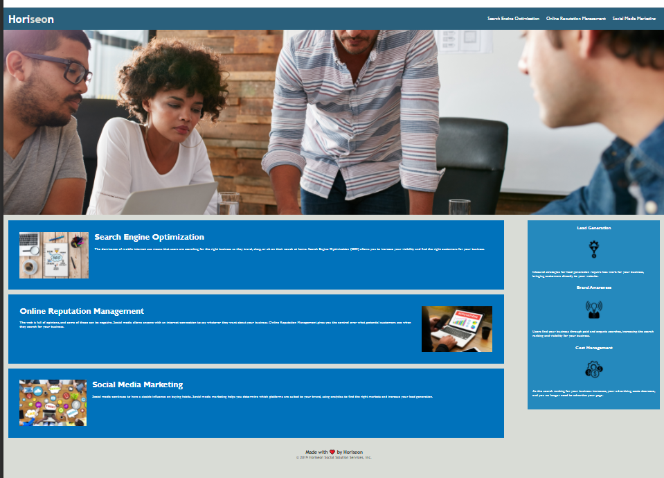

# Marketing Agency Code Refactor

The conents of this assignment are refactored HTML and CSS code. The original code was provided by the Bootcamp along with a User Story and Acceptance Criteria.

:link: [Horiseon Website](https://username and bootcamp file enter here.github.io/bootcamp-code-refactor/)

## User Story

AS A marketing agency
I WANT a codebase that follows accessibility standards
SO THAT our own site is optimized for search engines

## Acceptance Criteria

GIVEN a webpage meets accessibility standards
WHEN I view the source code
THEN I find semantic HTML elements
WHEN I view the structure of the HTML elements
THEN I find that the elements follow a logical structure independent of styling and positioning
WHEN I view the icon and image elements
THEN I find accessible alt attributes
WHEN I view the heading attributes
THEN they fall in sequential order
WHEN I view the title element
THEN I find a concise, descriptive title

## Website Image

## Credits

GitHub angelicampeso
GitHub Stefan-Aikins
Youtube TanUv90 - GitHub Readme Images Tutorial (screenshots in readmes)
